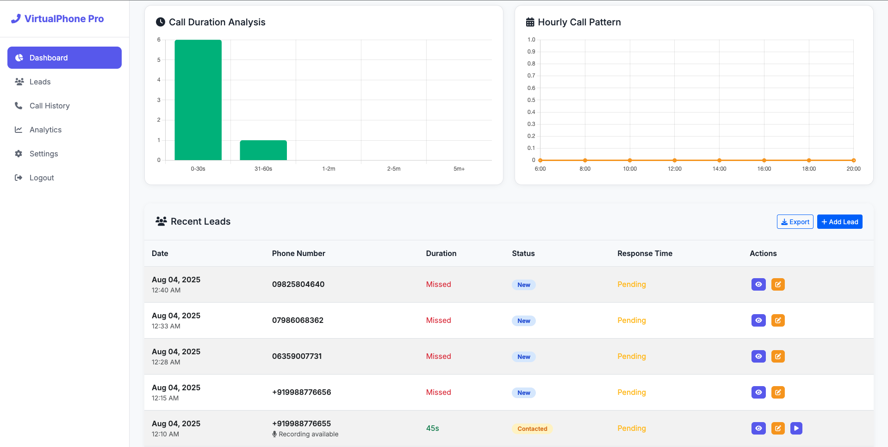

# 📞 Virt## 📸 Dashboard Preview

> **Real-time analytics dashboard showcasing lead management capabilities**


*Main dashboard showing lead conversion rates, call analytics, and performance metrics*


*Comprehensive lead tracking with status management and detailed call information*

*The analytics dashboard provides real-time insights into call patterns, lead conversion rates, and business performance metrics with interactive charts and comprehensive data visualization.*

---

## 🚀 Featuresd Catcher

[](https://www.djangoproject.com/)
[](https://www.python.org/)
[](https://opensource.org/licenses/MIT)
[](#testing)

A powerful Django-based lead management system that automatically captures and processes incoming phone calls through webhook integration. Transform your virtual phone system into a comprehensive lead generation and analytics platform.

## � Dashboard Preview

> **Add your dashboard screenshot here**


*The analytics dashboard provides real-time insights into call patterns, lead conversion rates, and business performance metrics with interactive charts and comprehensive data visualization.*

---

## �🚀 Features

### 📈 **Real-Time Analytics Dashboard**
- Interactive charts showing lead conversion rates
- Call duration analysis and trends
- Lead status distribution with visual insights
- Time-based lead tracking and reporting

### 🔗 **Webhook Integration**
- Secure webhook endpoints with UUID-based authentication
- Automatic lead creation from incoming calls
- Smart call status mapping (completed → contacted, missed → new)
- Support for major VoIP providers and phone systems

### 👤 **Multi-Client Management**
- Individual client accounts with isolated data
- Unique virtual number assignment
- Client-specific webhook URLs and tokens
- Comprehensive admin panel for client management

### 📊 **Lead Tracking & Management**
- Automatic lead status classification
- Call recording URL storage
- Response time tracking and analytics
- Notes and follow-up management

### 🔒 **Security & Authentication**
- Django's built-in authentication system
- CSRF protection for web interface
- Secure webhook endpoints with token validation
- Admin panel with role-based access

## 🛠️ Technology Stack

- **Backend**: Django 5.2.4 with Django REST Framework
- **Database**: SQLite (easily configurable for PostgreSQL/MySQL)
- **Frontend**: Bootstrap 5.3.0 with Chart.js for analytics
- **API**: RESTful endpoints with JSON responses
- **Deployment**: ngrok-ready with CSRF configuration

## 📦 Installation

### Prerequisites
- Python 3.13+
- pip package manager
- Virtual environment (recommended)

### Quick Start

1. **Clone the repository**
```bash
git clone https://github.com/yourusername/virtual-phone-lead-catcher.git
cd virtual-phone-lead-catcher
```

2. **Create and activate virtual environment**
```bash
python -m venv venv
source venv/bin/activate  # On Windows: venv\Scripts\activate
```

3. **Install dependencies**
```bash
pip install django djangorestframework
```

4. **Setup database**
```bash
python manage.py migrate
python manage.py createsuperuser
```

5. **Run the development server**
```bash
python manage.py runserver
```

6. **Access the application**
- Dashboard: http://localhost:8000/dashboard/
- Admin Panel: http://localhost:8000/admin/
- Landing Page: http://localhost:8000/

## 🔧 Configuration

### Webhook Setup

1. **Create a client in the admin panel**
2. **Copy the webhook URL from the client details**
3. **Configure your VoIP provider** to send webhooks to:
   ```
   https://yourdomain.com/webhook/{your-client-token}/
   ```

### Supported Webhook Parameters

The system processes incoming GET requests with these parameters:

| Parameter | Description | Required |
|-----------|-------------|----------|
| `CallSid` | Unique call identifier | ✅ |
| `From` | Caller's phone number | ✅ |
| `To` | Your virtual number | ✅ |
| `CallStatus` | Call status (completed, no-answer, busy, failed) | ✅ |
| `Direction` | Must be 'incoming' (outbound calls filtered) | ✅ |
| `DialCallDuration` | Call duration in seconds | ✅ |
| `StartTime` | Call start timestamp | ✅ |
| `RecordingUrl` | URL to call recording | ✅ |

### Environment Variables

Create a `.env` file for production:

```env
SECRET_KEY=your-django-secret-key
DEBUG=False
ALLOWED_HOSTS=yourdomain.com,www.yourdomain.com
CSRF_TRUSTED_ORIGINS=https://yourdomain.com
```

## 📊 API Endpoints

### Webhook Endpoint
```http
GET /webhook/{token}/?CallSid=123&From=+1234567890&CallStatus=completed&Direction=incoming
```

### Analytics API
```http
GET /analytics/
Authorization: Required (Login)
```

Response:
```json
{
  "status_counts": [{"status": "new", "count": 15}],
  "leads_over_time": [{"day": "2025-08-07", "count": 5}],
  "total_leads": 50,
  "conversion_rate": 23.5
}
```

### Leads API
```http
GET /leads/
POST /leads/
PUT /leads/{id}/
DELETE /leads/{id}/
```

## 🧪 Testing

Run the comprehensive test suite:

```bash
python manage.py test
```

### Test Coverage
- ✅ Webhook functionality with various call statuses
- ✅ Authentication and authorization
- ✅ Model validation and relationships
- ✅ API endpoint security
- ✅ Dashboard analytics accuracy
- ✅ Lead creation and updates

## 🚀 Deployment

### Using ngrok (Development/Testing)

1. **Install ngrok**
2. **Run your Django server**
```bash
python manage.py runserver
```

3. **Start ngrok tunnel**
```bash
ngrok http 8000
```

4. **Update settings.py**
```python
CSRF_TRUSTED_ORIGINS = ['https://your-ngrok-url.ngrok-free.app']
```

### Production Deployment

1. **Configure your web server** (Nginx/Apache)
2. **Setup SSL certificates**
3. **Update webhook URLs** in your VoIP provider
4. **Configure environment variables**

## 📱 Usage Examples

### Webhook Integration Example

When your VoIP provider sends a webhook:

```http
GET /webhook/abc123/?CallSid=call_001&From=+1234567890&To=+0987654321&CallStatus=completed&Direction=incoming&DialCallDuration=45&RecordingUrl=https://recordings.com/call_001.mp3
```

The system automatically:
1. ✅ Validates the webhook token
2. ✅ Filters for incoming calls only
3. ✅ Creates a new lead with status "contacted"
4. ✅ Stores call duration and recording URL
5. ✅ Updates analytics in real-time

### Dashboard Analytics

The dashboard provides:
- 📊 Lead conversion funnel
- 📈 Call volume trends
- ⏱️ Average response times
- 🎯 Performance metrics

## 🤝 Contributing

1. Fork the repository
2. Create a feature branch (`git checkout -b feature/amazing-feature`)
3. Commit your changes (`git commit -m 'Add amazing feature'`)
4. Push to the branch (`git push origin feature/amazing-feature`)
5. Open a Pull Request

## 📄 License

This project is licensed under the MIT License - see the [LICENSE](LICENSE) file for details.

## 🙏 Acknowledgments

- Django community for the robust framework
- Chart.js for beautiful analytics visualizations
- Bootstrap for responsive UI components

## 📧 Support

For support and questions:
- 📧 Email: your.email@example.com
- 🐛 Issues: [GitHub Issues](https://github.com/yourusername/virtual-phone-lead-catcher/issues)
- 📖 Documentation: [Wiki](https://github.com/yourusername/virtual-phone-lead-catcher/wiki)

---

⭐ **Star this repository if it helped you build something awesome!**
